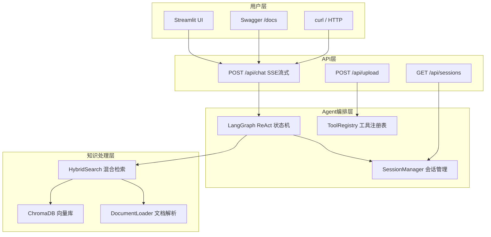

# 🤖 企业级 AI Agent 知识库问答系统


> 基于 LangChain + LangGraph + DeepSeek 构建的智能知识库问答系统。
> 支持多轮对话、混合检索、本地向量化（数据不出境）、FastAPI 服务化与 Docker 容器化部署。

---

## 🧭 架构图



---

## ✨ 核心功能

- **RAG 混合检索** — BM25 关键词 + 语义向量 + RRF 融合排序，兼顾术语精确匹配与语义理解
- **模型层可切换** — 对话模型与嵌入模型都走 `config/rag.yml` 配置：通义千问 / DeepSeek（OpenAI 兼容）二选一；嵌入可用 DashScope，也可换成本地 ONNX（BGE）推理，做到免 Embedding API key、数据不出境
- **热点问题缓存** — 命中直接回放，跳过 LLM 调用，降低延迟与成本（缓存键含用户维度，避免个性化答案串用户）
- **多轮对话与上下文压缩** — 滑动窗口 + 字符裁剪 + **Compaction 增量摘要**，SQLite 持久化，服务重启后对话不丢失
- **多用户与权限** — 会话/长期记忆按用户隔离，配置化角色权限，越权访问返回 403
- **Agent 智能编排** — LangGraph ReAct 循环（思考→工具调用→观察→回答）
- **文档自动导入** — 支持 txt / pdf / docx / csv / 图片，自动分块向量化
- **API 服务化** — FastAPI + SSE 真流式输出（逐 token，思考过程与答案分离），Swagger 自动文档
- **React 前端** — 逐字流式渲染、思考过程折叠、会话列表与用户切换
- **可观测与评测** — Trace + Metrics（P50/P95、真实 Token）；50 题固定测试集 Hit Rate@5 自动评测报告
- **Docker 部署** — 多阶段构建，docker-compose 一键启动

---

## ⚡ 快速启动

### 1. 环境准备

- Python 3.12+
- 大模型 API 密钥（**二选一**，在 `config/rag.yml` 里选 provider）：
  - 通义千问：`DASHSCOPE_API_KEY`（[获取地址](https://bailian.console.aliyun.com/)）——**当前默认**
  - DeepSeek：`DEEPSEEK_API_KEY`（[获取地址](https://platform.deepseek.com/api_keys)）

### 2. 安装

```bash
git clone https://github.com/refreedome/ai-agent-knowledge-system.git
cd ai-agent-knowledge-system

python -m venv .venv
# Windows
.venv\Scripts\activate
# macOS / Linux
source .venv/bin/activate

pip install -r requirements.txt
```

### 3. 配置密钥

```bash
# 推荐：使用 .env（密钥不提交 Git）
cp .env.example .env    # Windows: copy .env.example .env
# 编辑 .env，填入所选 provider 的密钥（默认用通义千问）：
#   DASHSCOPE_API_KEY=sk-你的密钥        （chat_provider/embedding_provider = dashscope）
#   DEEPSEEK_API_KEY=sk-你的密钥         （chat_provider = deepseek 时才需要）

# 或临时环境变量：
# Windows PowerShell
$env:DASHSCOPE_API_KEY="sk-你的密钥"

# macOS / Linux
export DEEPSEEK_API_KEY="sk-你的密钥"
```

### 4. 加载知识库

```bash
python -c "from rag.vector_store import VectorStoreService; vs = VectorStoreService(); vs.load_document()"
```

### 5. 运行

```bash
# 方式一：终端交互
python agent/react_agent.py

# 方式二：FastAPI 服务
python -m api.main
# 浏览器打开 http://localhost:8000/docs

# 方式三：Docker
docker compose up --build -d
```

### 6. 前端界面（React + Vite）

```bash
cd frontend
npm install
npm run dev
# 浏览器打开 http://localhost:5173
```

> 开发模式下 Vite 已把 `/api` 代理到 `http://127.0.0.1:8000`（见 `frontend/vite.config.ts`），
> 需先启动 FastAPI 后端（方式二）。前端支持流式对话、会话管理、文档上传。
> 另外 `app.py` 提供了一个 Streamlit 原型界面：`streamlit run app.py`。

---

## 🚀 部署上线（生产）

### 1. 准备密钥与配置

```bash
cp .env.example .env    # Windows: copy .env.example .env
# 编辑 .env，填入所选 provider 的密钥（默认通义千问 DASHSCOPE_API_KEY）；生产环境按需设置 ALLOWED_ORIGINS（逗号分隔的真实域名/IP）
```

> ⚠️ `.env` 已在 `.gitignore` 中，密钥绝不提交到 Git。

### 2. 本机一键启动

```bash
docker compose up -d --build
docker compose ps          # 状态应为 healthy
curl http://localhost:8000/api/health
```

### 3. 部署到云服务器（Ubuntu 22.04）

```bash
# ① 安装 Docker
curl -fsSL https://get.docker.com | sh

# ② 拉取代码
git clone https://github.com/refreedome/ai-agent-knowledge-system.git
cd ai-agent-knowledge-system

# ③ 配置密钥（服务器上执行）
cp .env.example .env && vim .env

# ④ 构建并启动
docker compose up -d --build

# ⑤ 验证
curl http://localhost:8000/api/health
```

- 云厂商安全组/防火墙放行 **8000** 端口
- 浏览器打开 `http://你的公网IP:8000/docs` 即上线成功

### 4. 进阶：域名 + HTTPS

```bash
# Nginx 反向代理 + Let's Encrypt 免费证书
sudo apt install nginx certbot python3-certbot-nginx
# 配置 server_name api.你的域名.com 反代到 127.0.0.1:8000
sudo certbot --nginx -d api.你的域名.com
```

### 5. 生产配置说明（面试可讲）

| 配置 | 作用 |
|------|------|
| `restart: unless-stopped` | 服务器重启后容器自动拉起 |
| `volumes` 挂载 | chroma_db / md5.text / logs 持久化，容器重建数据不丢 |
| `healthcheck` | 定期 curl `/api/health`，异常可被编排系统感知 |
| `ALLOWED_ORIGINS` | CORS 白名单，生产收紧为真实域名，防跨域滥用 |

---

## 📡 API 文档

| 方法 | 路径 | 说明 | 请求体 |
|------|------|------|--------|
| `GET` | `/api/health` | 健康检查 | - |
| `GET` | `/api/users` | 用户列表（含角色与权限，供切换用户） | - |
| `POST` | `/api/chat` | 流式对话（SSE） | `{"query": "...", "session_id": "可选", "user_id": "可选"}` |
| `POST` | `/api/upload` | 上传文档（服务端路径，需 admin） | `{"file_path": "绝对路径"}` |
| `POST` | `/api/upload/file` | 上传文档（multipart 表单，需 admin） | `file` 字段（txt/pdf/docx/csv/图片） |
| `GET` | `/api/sessions` | 会话列表（按用户隔离，admin 可查全部） | - |
| `GET` | `/api/sessions/{id}/messages` | 会话历史消息 | - |
| `DELETE` | `/api/sessions/{id}` | 清理会话 | - |
| `GET` | `/api/cache` | 热点问题缓存统计（命中率/大小） | - |
| `GET` | `/api/metrics` | 性能指标（P50/P95、Token、成功率） | - |

> 身份通过请求头 `X-User-Id` 传入（见 `config/users.yml` 的用户与角色配置）；
> 普通用户越权查询他人会话或上传文档会返回 403。

### 测试与评测

单元测试、检索评测（Hit Rate@5）、生成质量评测（RAGAS）与权限回归的说明见 **[TESTING.md](TESTING.md)**；
最新评测报告见 `evaluation/评测报告-HitRate@5.md`。

### 测试示例

```bash
curl -N -X POST http://localhost:8000/api/chat \
  -H "Content-Type: application/json" \
  -d '{"query": "小户型适合哪些扫地机器人？"}'
```

---

## 📂 项目结构

```
├── agent/               # Agent 编排层
│   ├── tools/           #   工具集（知识检索/文档上传）
│   ├── middleware.py    #   全流程日志中间件
│   └── react_agent.py   #   ReAct Agent 主入口
├── api/                 # API 服务层
│   ├── main.py          #   FastAPI 路由 + SSE
│   └── schemas.py       #   Pydantic 数据模型
├── rag/                 # 知识处理层
│   ├── hybrid_search.py #   BM25 + 语义 + RRF
│   ├── vector_store.py  #   ChromaDB 封装
│   └── rag_service.py   #   总结服务
├── database/            # 持久化层
│   └── session_manager.py  # 会话管理（SQLite）
├── model/               # 模型层
│   └── factory.py       #   模型工厂（对话/嵌入均可按配置切换供应商）
├── config/              # 配置层（YAML）
├── utils/               # 工具层
├── document/            # 文档处理器
├── Dockerfile           # 容器镜像
├── docker-compose.yml   # 容器编排
└── requirements.txt     # Python 依赖
```

---

## 🛠️ 技术栈

| 分类 | 技术 | 用途 |
|------|------|------|
| AI 框架 | LangChain + LangGraph | Agent 编排、ReAct 循环 |
| 大语言模型 | 通义千问 qwen-plus（默认）/ DeepSeek（OpenAI 兼容，可切换） | 对话生成、工具调用 |
| Embedding | DashScope text-embedding-v4（默认）/ FastEmbed + BGE-small-zh（本地 ONNX，免 key） | 文本向量化 |
| 向量数据库 | ChromaDB | 知识库向量存储 |
| 混合检索 | BM25Okapi + jieba + RRF | 关键词+语义融合检索 |
| Web 框架 | FastAPI + Uvicorn | HTTP 服务、SSE 流式 |
| 文档解析 | pypdf / python-docx / pytesseract | 多格式文档导入 |
| 数据持久化 | SQLite | 会话历史存储 |
| 容器化 | Docker + docker-compose | 构建部署 |

---


## 📄 许可证

MIT License © 2025
