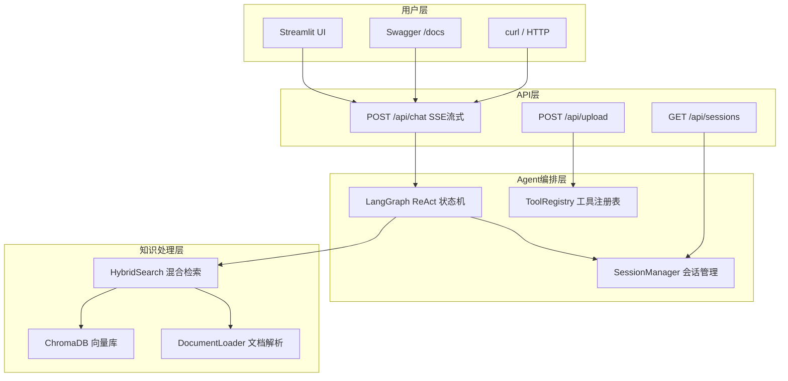

# 🤖 企业级 AI Agent 知识库问答系统


> 基于 LangChain + LangGraph + DeepSeek 构建的智能知识库问答系统。
> 支持多轮对话、混合检索、本地向量化（数据不出境）、FastAPI 服务化与 Docker 容器化部署。

---

## 🧭 架构图



---

## ✨ 核心功能

- **RAG 混合检索** — BM25 关键词 + 语义向量 + RRF 融合排序，兼顾术语精确匹配与语义理解
- **本地向量化** — FastEmbed（BGE ONNX）本地推理，敏感数据不出境，无需额外 Embedding API
- **热点问题缓存** — 命中直接回放，跳过 LLM 调用，降低延迟与成本
- **多轮对话** — Session 会话管理，SQLite 持久化，服务重启后对话不丢失
- **Agent 智能编排** — LangGraph ReAct 循环（思考→工具调用→观察→回答）
- **文档自动导入** — 支持 txt / pdf / docx / csv / 图片，自动分块向量化
- **API 服务化** — FastAPI + SSE 流式输出，Swagger 自动文档
- **Docker 部署** — 多阶段构建，docker-compose 一键启动

---

## ⚡ 快速启动

### 1. 环境准备

- Python 3.12+
- DeepSeek API 密钥（[获取地址](https://platform.deepseek.com/api_keys)）

### 2. 安装

```bash
git clone https://github.com/refreedome/ai-agent-knowledge-system.git
cd ai-agent-knowledge-system

python -m venv .venv
# Windows
.venv\Scripts\activate
# macOS / Linux
source .venv/bin/activate

pip install -r requirements.txt
```

### 3. 配置密钥

```bash
# 推荐：使用 .env（密钥不提交 Git）
cp .env.example .env    # Windows: copy .env.example .env
# 编辑 .env，填入 DEEPSEEK_API_KEY

# 或临时环境变量：
# Windows PowerShell
$env:DEEPSEEK_API_KEY="sk-你的密钥"

# macOS / Linux
export DEEPSEEK_API_KEY="sk-你的密钥"
```

### 4. 加载知识库

```bash
python -c "from rag.vector_store import VectorStoreService; vs = VectorStoreService(); vs.load_document()"
```

### 5. 运行

```bash
# 方式一：终端交互
python agent/react_agent.py

# 方式二：FastAPI 服务
python -m api.main
# 浏览器打开 http://localhost:8000/docs

# 方式三：Docker
docker compose up --build -d
```

---

## 🚀 部署上线（生产）

### 1. 准备密钥与配置

```bash
cp .env.example .env    # Windows: copy .env.example .env
# 编辑 .env，填入 DEEPSEEK_API_KEY；生产环境按需设置 ALLOWED_ORIGINS（逗号分隔的真实域名/IP）
```

> ⚠️ `.env` 已在 `.gitignore` 中，密钥绝不提交到 Git。

### 2. 本机一键启动

```bash
docker compose up -d --build
docker compose ps          # 状态应为 healthy
curl http://localhost:8000/api/health
```

### 3. 部署到云服务器（Ubuntu 22.04）

```bash
# ① 安装 Docker
curl -fsSL https://get.docker.com | sh

# ② 拉取代码
git clone https://github.com/refreedome/ai-agent-knowledge-system.git
cd ai-agent-knowledge-system

# ③ 配置密钥（服务器上执行）
cp .env.example .env && vim .env

# ④ 构建并启动
docker compose up -d --build

# ⑤ 验证
curl http://localhost:8000/api/health
```

- 云厂商安全组/防火墙放行 **8000** 端口
- 浏览器打开 `http://你的公网IP:8000/docs` 即上线成功

### 4. 进阶：域名 + HTTPS

```bash
# Nginx 反向代理 + Let's Encrypt 免费证书
sudo apt install nginx certbot python3-certbot-nginx
# 配置 server_name api.你的域名.com 反代到 127.0.0.1:8000
sudo certbot --nginx -d api.你的域名.com
```

### 5. 生产配置说明（面试可讲）

| 配置 | 作用 |
|------|------|
| `restart: unless-stopped` | 服务器重启后容器自动拉起 |
| `volumes` 挂载 | chroma_db / md5.text / logs 持久化，容器重建数据不丢 |
| `healthcheck` | 定期 curl `/api/health`，异常可被编排系统感知 |
| `ALLOWED_ORIGINS` | CORS 白名单，生产收紧为真实域名，防跨域滥用 |

---

## 📡 API 文档

| 方法 | 路径 | 说明 | 请求体 |
|------|------|------|--------|
| `GET` | `/api/health` | 健康检查 | - |
| `POST` | `/api/chat` | 流式对话（SSE） | `{"query": "...", "session_id": "可选"}` |
| `POST` | `/api/upload` | 上传文档 | `{"file_path": "绝对路径"}` |
| `GET` | `/api/sessions` | 会话列表 | - |
| `DELETE` | `/api/sessions/{id}` | 清理会话 | - |
| `GET` | `/api/cache` | 热点问题缓存统计（命中率/大小） | - |
| `GET` | `/api/metrics` | 延迟 / Token / 成功率指标 | - |

### 测试示例

```bash
curl -N -X POST http://localhost:8000/api/chat \
  -H "Content-Type: application/json" \
  -d '{"query": "小户型适合哪些扫地机器人？"}'
```

---

## 📂 项目结构

```
├── agent/               # Agent 编排层
│   ├── tools/           #   工具集（知识检索/文档上传）
│   ├── middleware.py    #   全流程日志中间件
│   └── react_agent.py   #   ReAct Agent 主入口
├── api/                 # API 服务层
│   ├── main.py          #   FastAPI 路由 + SSE
│   └── schemas.py       #   Pydantic 数据模型
├── rag/                 # 知识处理层
│   ├── hybrid_search.py #   BM25 + 语义 + RRF
│   ├── vector_store.py  #   ChromaDB 封装
│   └── rag_service.py   #   总结服务
├── database/            # 持久化层
│   └── session_manager.py  # 会话管理（SQLite）
├── model/               # 模型层
│   └── factory.py       #   模型工厂（DeepSeek 聊天 / 本地 BGE Embedding）
├── config/              # 配置层（YAML）
├── utils/               # 工具层
├── document/            # 文档处理器
├── Dockerfile           # 容器镜像
├── docker-compose.yml   # 容器编排
└── requirements.txt     # Python 依赖
```

---

## 🛠️ 技术栈

| 分类 | 技术 | 用途 |
|------|------|------|
| AI 框架 | LangChain + LangGraph | Agent 编排、ReAct 循环 |
| 大语言模型 | DeepSeek（deepseek-v4-flash，OpenAI 兼容） | 对话生成、工具调用 |
| Embedding | FastEmbed + BGE-small-zh（本地 ONNX） | 文本向量化，数据不出境 |
| 向量数据库 | ChromaDB | 知识库向量存储 |
| 混合检索 | BM25Okapi + jieba + RRF | 关键词+语义融合检索 |
| Web 框架 | FastAPI + Uvicorn | HTTP 服务、SSE 流式 |
| 文档解析 | pypdf / python-docx / pytesseract | 多格式文档导入 |
| 数据持久化 | SQLite | 会话历史存储 |
| 容器化 | Docker + docker-compose | 构建部署 |

---


## 📄 许可证

MIT License © 2025
